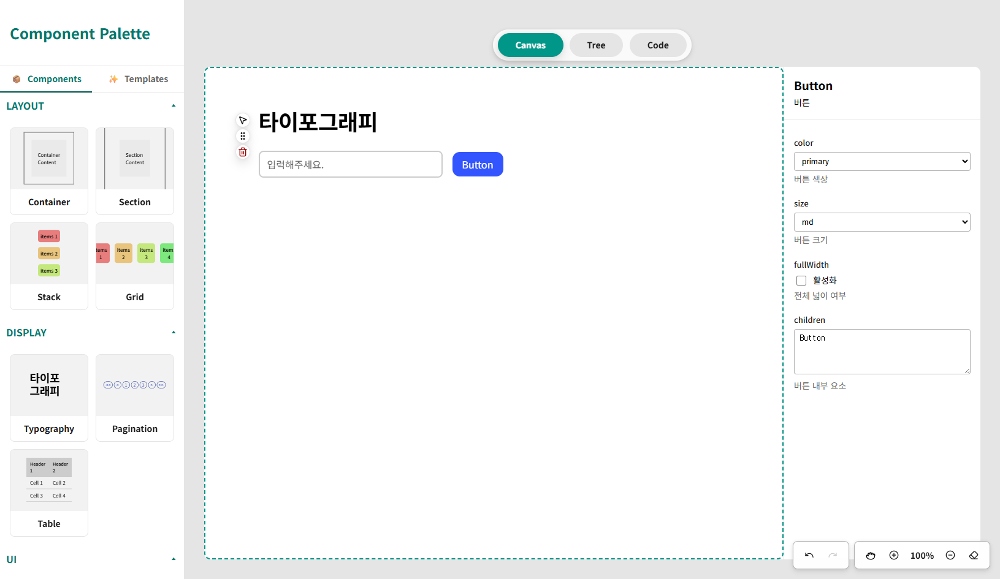
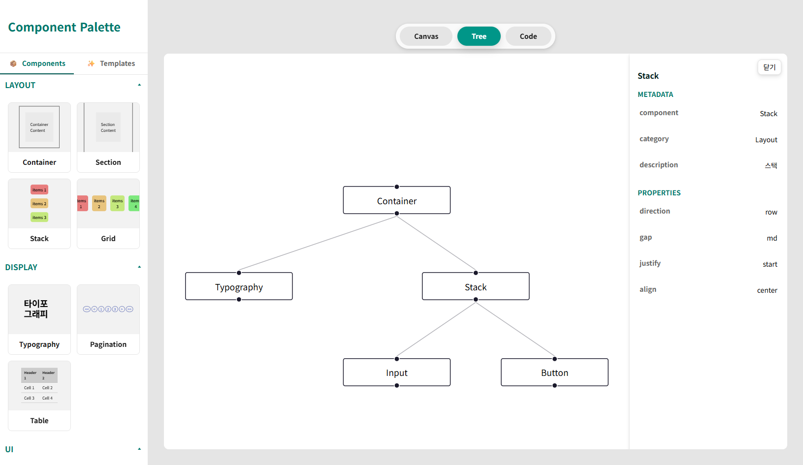
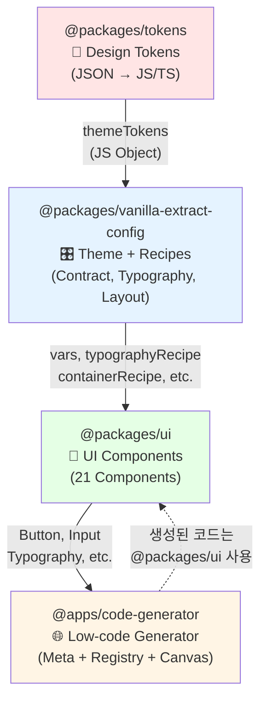

# Low-code UI Generator

[](https://68e9f38314b1616683e9ecc0-fvjybvzxkh.chromatic.com/)
[]()
[]()

> 디자인 시스템 기반의 시각적 페이지 빌더로 드래그 앤 드롭을 통해 React 컴포넌트를 구성하고 즉시 프로덕션 레디 코드를 생성합니다.

## Preview





---

## 📑 목차

- [제품 개요](#-제품-개요)
- [타겟 사용자](#-타겟-사용자)
- [핵심 기능](#-핵심-기능)
- [기술 스택](#️-기술-스택)
- [프로젝트 구조](#-프로젝트-구조)
- [패키지 상세 문서](#-패키지-상세-문서-tech-specs)
- [개발 로드맵](#️-개발-로드맵)
- [성공 지표](#-성공-지표)
- [시작하기](#-시작하기)

---

## 💡 제품 개요

### 핵심 가치 제안

**디자이너를 위해**

- 디자인이 실제 화면에서 어떻게 구현되는지 실시간으로 확인
- 디자인 토큰 기반으로 일관된 스타일 보장
- Storybook을 통한 컴포넌트 라이브러리 시각적 탐색

**프론트엔드 개발자를 위해**

- 드래그 앤 드롭으로 UI를 구성하고 즉시 React 코드(.tsx) 생성
- 타입 안전한 코드 자동 생성으로 개발 생산성 향상
- 디자인 시스템과 100% 일치하는 코드 출력

### 제품 목표

디자인 시스템 기반의 시각적 페이지 빌더를 통해 **개발자와 디자이너 간의 협업을 개선**하고 **프론트엔드 개발 속도를 3배 향상**시킨다.

---

## 🙍🏻‍♀️ 타겟 사용자

### 1차 사용자: 프론트엔드 개발자

- **Pain Point**: 반복적인 CRUD 페이지 작성으로 인한 개발 시간 소모
- **Goal**: 빠른 페이지 프로토타이핑 및 기본 구조 생성
- **Success Metric**: 기본 CRUD 페이지 개발 시간 80% 단축 (2시간 → 20분)

### 2차 사용자: UI/UX 디자이너

- **Pain Point**: 디자인과 실제 구현 결과물 간의 불일치
- **Goal**: 디자인 의도가 정확히 구현되는지 실시간 확인
- **Success Metric**: 디자인-개발 피드백 사이클 시간 70% 단축

---

## ✅ 핵심 기능

### 1. 디자인 시스템 기반 컴포넌트 라이브러리

**21개 프로덕션 레디 컴포넌트**

- **Layout** (4): Container, Section, Stack, Grid
- **Display** (3 + 6 하위): Typography, Pagination, Table (+ Thead, Tbody, Tr, Th, Td, Caption)
- **Form** (5): Input, Textarea, Select, Checkbox, Radio
- **UI** (2): Button, Divider

**디자인 토큰 기반 Variant 시스템**

- Color: 7가지 semantic color (brand, primary, secondary, tertiary, info, success, warning, danger)
- Size: 3가지 size (sm, md, lg)
- Typography: 20가지 role (heading, text, display, caption, code 등)

📚 [**Storybook에서 모든 컴포넌트 탐색하기**](https://68e9f38314b1616683e9ecc0-fvjybvzxkh.chromatic.com/)

### 2. 드래그 앤 드롭 비주얼 에디터

**직관적인 3-Panel 인터페이스**


- **좌측 패널**: 컴포넌트 팔레트 - 카테고리별로 정리된 컴포넌트 목록 구성
- **중앙 패널**: Canvas View - 드래그 앤 드롭으로 실시간 페이지 구성
- **우측 패널**: Props Editor - 선택된 컴포넌트의 속성 편집

**고급 드래그 앤 드롭 기능**

- **중첩 Droppable**: Layout 컴포넌트 내부에 다른 컴포넌트 배치 가능
- **Custom Collision Detection**: 95%+ 정확도의 중첩 영역 감지 알고리즘
- **Smart Drop Intent**: 포인터 위치에 따라 nest/sort 자동 판단 (상단 20% = sort:before, 하단 20% = sort:after, 중앙 60% = nest)
- **Tree View**: React Flow 기반 컴포넌트 계층 구조 시각화
  

**특별 기능: Table Scaffold 시스템**

- Table 드래그 시 완전한 HTML 구조 자동 생성 (table > thead > tr > th, tbody > tr > td)
- Acorn JSX Parser 기반 Scaffold → TreeNode 변환
- Excel/Sheets 스타일의 행/열 추가/삭제 UI

### 3. 실시간 Props 편집 시스템

**Component Meta 기반 Props Editor**

- Control Type: text, number, boolean, select, radio, color, json
- 토큰 기반 옵션: color는 7개 중 4개만 선택 (UX 최적화)
- 실시간 Preview 반영: Props 변경 즉시 Canvas에 반영

**History & Keyboard Shortcuts**

- Undo/Redo: 최대 50 history 관리
- 8가지 키보드 단축키 (Ctrl+Z, Ctrl+Shift+Z, Ctrl+D, Delete, Ctrl+↑/↓, Ctrl+Shift+S/C)
- 선택된 노드 자동 추적 및 동기화

### 4. 프로덕션 레디 코드 생성

**타입 안전한 React 코드 생성**

- Tree 구조 → React TSX 자동 변환
- Import 문 자동 생성 및 최적화
- TypeScript Props 인터페이스 자동 정의
- Clean Code 원칙 적용 (의미있는 변수명, 적절한 들여쓰기)

**Monaco Editor 통합**


- VS Code 스타일 코드 에디터를 통한 Generating된 Code Viewer 제공
- Syntax Highlighting 및 자동완성
- Download/Copy 기능

**Template 시스템**

- 사전 정의된 템플릿 (Login Form, Dashboard 등)
- 한 번의 클릭으로 완전한 페이지 구조 생성

---

## ⚙️ 기술 스택

### Frontend Core

| 기술           | 버전   | 용도                                  |
| -------------- | ------ | ------------------------------------- |
| **React**      | 19.1.1 | UI 프레임워크                         |
| **TypeScript** | 5.0+   | 타입 안전성                           |
| **Vite**       | 7.1.7  | 빌드 도구 및 개발 서버                |
| **Zustand**    | 5.0.8  | 상태 관리 (Tree Store, History Store) |

### Design System

| 패키지                               | 역할                      |
| ------------------------------------ | ------------------------- |
| **@packages/tokens**                 | 디자인 토큰 정의 및 변환  |
| **@packages/vanilla-extract-config** | Theme Contract 및 Recipe  |
| **@packages/ui**                     | React 컴포넌트 라이브러리 |

**디자인 토큰 워크플로우**

```
JSON Tokens (Style Dictionary)
  → JavaScript Objects + TypeScript Types
    → Vanilla Extract (Theme Contract + Recipes)
      → React Components (Type-safe Variants)
        → Code Generator (Meta-driven Props)
```

**스타일링 시스템**

- **Style Dictionary**: JSON → 다중 플랫폼 변환 (CSS Variables, JS, TS)
- **Vanilla Extract**: Zero-runtime CSS-in-TypeScript
  - `createThemeContract` + `createGlobalTheme`: 전역 CSS 변수 정의
  - `recipe`: Typography, Layout 등 복합 variant 스타일
- **토큰 기반 Variant**: 모든 스타일 값이 디자인 토큰에서 파생

### Code Generator Specific

| 기술                     | 버전   | 용도                       |
| ------------------------ | ------ | -------------------------- |
| **@dnd-kit/core**        | 6.0.8  | 드래그 앤 드롭             |
| **@dnd-kit/sortable**    | 7.0.2  | 정렬 가능한 리스트         |
| **@xyflow/react**        | 12.9.0 | Tree View 시각화           |
| **@monaco-editor/react** | 4.7.0  | 코드 에디터                |
| **Acorn**                | 8.15.0 | JSX 파싱 (Scaffold 시스템) |

[📖 **Code Generator 상세 Tech Spec**](./apps/code-generator/code-generator-tech-spec.md)

### 개발 도구

- **Turborepo**: 모노레포 빌드 최적화
- **pnpm**: 패키지 매니저
- **Storybook**: 컴포넌트 문서화 및 시각적 테스트
- **Chromatic**: Storybook 배포 및 Visual Regression Testing
- **ESLint + Prettier**: 코드 품질 관리

---

## 📖 패키지 상세 문서 (Tech Specs)

각 패키지의 심층 기술 문서를 확인하세요:

### Core Packages

| 패키지                               | 설명                                                                                                                               | Tech Spec                                                                             |
| ------------------------------------ | ---------------------------------------------------------------------------------------------------------------------------------- | ------------------------------------------------------------------------------------- |
| **@packages/tokens**                 | 디자인 토큰 관리 시스템<br/>- Style Dictionary 기반 변환<br/>- Foundation + Semantic 2-tier 구조<br/>- Vanilla Extract 최적화 포맷 | [📖 상세 보기](./packages/tokens/tokens-tech-spec.md)                                 |
| **@packages/vanilla-extract-config** | Vanilla Extract 설정<br/>- Theme Contract 생성<br/>- Typography Recipe (20 roles)<br/>- Layout Recipes (Container, Stack, Grid)    | [📖 상세 보기](./packages/vanilla-extract-config/vanilla-extract-config-tech-spec.md) |
| **@packages/ui**                     | React 컴포넌트 라이브러리<br/>- 21개 프로덕션 레디 컴포넌트<br/>- Variant 시스템 (50+ 조합)<br/>- Storybook 문서화                 | [📖 상세 보기](./packages/ui/ui-tech-spec.md)                                         |

### Application

| 앱                       | 설명                                                                                                                                                                 | Tech Spec                                                         |
| ------------------------ | -------------------------------------------------------------------------------------------------------------------------------------------------------------------- | ----------------------------------------------------------------- |
| **@apps/code-generator** | Low-code UI Generator<br/>- Drag & Drop 비주얼 에디터<br/>- Custom Collision Detection (95%+ 정확도)<br/>- Scaffold 시스템 (Acorn 기반)<br/>- Code Generation Engine | [📖 상세 보기](./apps/code-generator/code-generator-tech-spec.md) |

### Tech Spec 주요 내용

각 Tech Spec 문서는 다음을 포함합니다:

- **프로젝트 개요**: 패키지의 역할과 목적
- **기술 스택**: 사용된 기술과 선택 이유
- **핵심 기능**: 상세 구현 예제와 코드
- **개인적인 회고**: 문제 인식 → 해결 → 개선 아이디어
- **성과 및 영향**: 정량적/정성적 성과

---

## 📁 전체 프로젝트 구조

```text
.
├── apps/                          # 애플리케이션
│   └── code-generator/            # 🌐 Low-code Generator App
│       ├── src/
│       │   ├── registry/          # Component Meta & Registry (핵심!)
│       │   │   ├── types.ts       # Meta 타입 정의
│       │   │   ├── component-registry.ts  # Registry 통합
│       │   │   ├── category/      # 카테고리별 registry
│       │   │   └── meta/          # 컴포넌트별 meta 정의
│       │   ├── store/
│       │   │   ├── treeStore.ts   # Component Tree 상태 (Zustand)
│       │   │   └── historyStore.ts  # Undo/Redo 관리
│       │   ├── components/
│       │   │   ├── canvas/        # Canvas View
│       │   │   ├── drag-and-drop/ # D&D 컴포넌트
│       │   │   ├── tree/          # React Flow Tree View
│       │   │   ├── property/      # Props Editor
│       │   │   ├── code-editor/   # Monaco Editor
│       │   │   └── component-palette/  # Component Palette
│       │   ├── utils/
│       │   │   ├── collisionDetection.ts  # Custom collision 알고리즘
│       │   │   ├── treeHelper.ts          # Tree 조작 유틸리티
│       │   │   ├── parseScaffoldToTree.ts # Acorn JSX Parser
│       │   │   └── codeGenerator.ts       # Code 생성 엔진
│       │   ├── hooks/
│       │   │   ├── useTableNodeEdit.ts    # Table 편집 로직
│       │   │   ├── useKeyboardShortcuts.ts
│       │   │   └── useDragAndDrop.ts
│       │   └── templates/         # 기본 레이아웃 템플릿
│       └── package.json
│
├── packages/                      # 공통 라이브러리
│   ├── tokens/                    # 🎨 Design Tokens
│   │   ├── build/                 # Style Dictionary 빌드 결과물
│   │   │   ├── css/               # → CSS Variables
│   │   │   └── design-tokens/     # → Vanilla Extract용 JS/TS
│   │   ├── scripts/
│   │   │   ├── build.js           # Style Dictionary 빌드
│   │   │   └── watch.js           # 실시간 변경 감지
│   │   ├── src/
│   │   │   ├── foundation/        # Foundation 토큰 (색상, 타이포, spacing 등)
│   │   │   └── semantic/          # Semantic 토큰 (역할 기반)
│   │   └── package.json
│   │
│   ├── vanilla-extract-config/    # 🎛 Vanilla Extract 설정
│   │   ├── src/
│   │   │   ├── theme.css.ts       # Theme Contract 정의
│   │   │   ├── typography.css.ts  # Typography Recipe (20 roles)
│   │   │   ├── layout.css.ts      # Layout Recipes (Container, Stack, Grid)
│   │   │   ├── constants/
│   │   │   │   └── theme.ts       # 공통 타입 및 상수
│   │   │   └── index.ts
│   │   └── package.json
│   │
│   └── ui/                        # 🧩 UI 컴포넌트 라이브러리
│       ├── src/
│       │   ├── components/
│       │   │   ├── layout/        # Container, Section, Stack, Grid
│       │   │   ├── display/       # Typography, Pagination, Table
│       │   │   ├── ui/            # Button, Divider
│       │   │   └── inputs/        # Input, Select, Checkbox, Radio, Textarea
│       │   ├── styles/
│       │   │   └── global.css.ts  # ✅ Global Theme 적용 (여기서!)
│       │   ├── utils/
│       │   │   └── cn.ts          # className 유틸리티
│       │   └── index.ts
│       ├── .storybook/            # Storybook 설정
│       └── package.json
│
├── repo/                          # 공통 설정
│   ├── eslint-config/
│   └── typescript-config/
│
├── turbo.json                     # Turborepo 빌드 파이프라인
├── pnpm-workspace.yaml
└── package.json
```

### 패키지 의존성 흐름



### 핵심 아키텍처 포인트

1. **토큰 우선 설계**: 모든 스타일 값이 `@packages/tokens`에서 시작
2. **Zero-runtime CSS**: Vanilla Extract로 빌드 타임에 CSS 생성
3. **Meta 기반 Props 관리**: Component Meta는 `apps/code-generator`에서 정의 (UI 패키지의 유연성 유지)
4. **타입 안전성**: TypeScript로 전체 플로우 타입 보장

---

## 🗓️ 개발 로드맵

### ✅ Phase 1: Design Foundation (Week 1-3)

**목표**: 디자인 시스템의 기반 구축

**Week 1: 디자인 토큰 시스템**

- [x] Style Dictionary 설정 및 토큰 정의 (Foundation + Semantic)
- [x] Vanilla Extract용 커스텀 포맷 개발
- [x] CSS Variables + TypeScript 타입 자동 생성
- [x] Watch 모드 구현 (chokidar 기반)

**Week 2-3: 컴포넌트 시스템**

- [x] Theme Contract 및 Recipe 정의
- [x] 21개 컴포넌트 개발 (Layout, Display, Form, UI)
- [x] Storybook 환경 설정 및 문서화
- [x] Chromatic 배포 파이프라인 구축

**성과**: 150+ 토큰, 21개 컴포넌트, 60+ Storybook Stories

### ✅ Phase 2: Visual Editor Core (Week 4-6)

**목표**: 드래그 앤 드롭 기반 비주얼 에디터 구현

**Week 4: 컴포넌트 팔레트**

- [x] Component Meta 스키마 설계
- [x] 카테고리별 컴포넌트 팔레트 UI
- [x] Meta → Props Editor 자동 생성

**Week 5: Canvas & Drag-and-Drop**

- [x] @dnd-kit 통합
- [x] Custom Collision Detection 알고리즘 (95%+ 정확도)
- [x] TreeNode 구조 설계 및 렌더링

**Week 6: Tree View**

- [x] React Flow 기반 트리 시각화
- [x] Canvas ↔ Tree View 양방향 동기화

**성과**: 중첩 Droppable 지원, 실시간 Preview

### ✅ Phase 3: Advanced Features (Week 7-9)

**목표**: Props 편집 및 코드 생성 기능

**Week 7-8: Props Editor**

- [x] 선택된 노드의 Props 패널 UI
- [x] Control Type별 입력 컴포넌트 (text, select, boolean, json)
- [x] 실시간 Preview 반영
- [x] History & Undo/Redo (최대 50 history)

**Week 9: Code Generation Engine**

- [x] TreeNode → React TSX 변환
- [x] Import 문 자동 생성
- [x] TypeScript Props 인터페이스 생성
- [x] Monaco Editor 통합

**성과**: 8가지 키보드 단축키, 타입 안전한 코드 생성

### ✅ Phase 4: Special Features (Week 10-11)

**목표**: 고급 기능 및 UX 개선

**Week 10: Scaffold System**

- [x] Acorn JSX Parser 통합
- [x] Table Scaffold 자동 생성
- [x] HTML 구조 보장 (table > thead > tr > th)

**Week 11: Table Data Grid**

- [x] Excel 스타일 행/열 추가/삭제
- [x] 최소 1 row/column 보장
- [x] Inline Cell 편집

**성과**: HTML 구조 오류 100% 방지

### ✅ Phase 5: Polish & Optimization (Week 12-13)

**목표**: 성능 최적화 및 사용성 개선

**Week 12: Template System**

- [x] 3가지 기본 템플릿 (Login Form, Dashboard, Landing)
- [x] Template → TreeNode 변환
- [x] 한 번의 클릭으로 완전한 페이지 구조 생성

**Week 13: Integration & Testing**

- [x] End-to-end 사용자 시나리오 테스트
- [x] 성능 최적화 (50개 컴포넌트까지 지연 없음)
- [x] 버그 수정 및 UX 개선

**최종 성과**

- ✅ Collision Detection 정확도: 95%+
- ✅ History 용량: 50 states
- ✅ Keyboard Shortcuts: 8개
- ✅ Bundle Size: ~250KB (minified + gzipped)
- ✅ Code Generation Speed: <100ms 평균

---

## 🏁 성공 지표

### 개인적 성장 목표 (학습 경험)

**기술적 역량**

- ✅ **Drag & Drop 마스터**: @dnd-kit 기반 복잡한 중첩 구조 구현 경험
- ✅ **Tree 구조 관리**: JSON 기반 노드 트리 설계 및 실시간 Preview 동기화
- ✅ **코드 생성 엔진**: AST 변환, TypeScript 타입 자동 생성 경험
- ✅ **디자인 시스템 구축**: 토큰 → Config → Components 전체 플로우 경험
- ✅ **Monorepo 관리**: Turborepo 기반 빌드 파이프라인 최적화

**제품 개발 프로세스**

- ✅ **MVP 설계**: 핵심 가치 제안 정의 → 기능 우선순위 결정 → 단계별 개발
- ✅ **문서화 문화**: Storybook 기반 컴포넌트 문서화 및 Visual Testing
- ✅ **설계 패턴 학습**: Component Meta, Registry, Scaffold 등 확장 가능한 아키텍처 설계

### 제품 성과 지표

**개발 생산성**

- 🎯 CRUD 페이지 개발 시간 **80% 단축** (2시간 → 20분)
- 🎯 Component 팔레트 → Canvas → Code 생성까지 **평균 10분 이내**

**코드 품질**

- ✅ 생성된 코드의 **TypeScript 타입 안정성 100%**
- ✅ ESLint 통과율 **95% 이상**
- ✅ 디자인 시스템과 **100% 일치**하는 코드 출력

**기술적 안정성**

- ✅ 50개 컴포넌트까지 **지연 없는** 드래그 앤 드롭
- ✅ Collision Detection 정확도 **95%+**
- ✅ 크리티컬 버그 **0건**

**사용자 경험**

- 🎯 10명의 베타 사용자가 각각 5개 이상의 페이지 성공적으로 생성
- 🎯 사용자 피드백 점수 **8점 이상** (10점 만점)
- 🎯 생성된 코드의 **90% 이상**이 수정 없이 프로젝트 적용 가능

---

## 🚀 시작하기

### 사전 요구사항

- Node.js 18+
- pnpm 8+

### 설치

```bash
# 저장소 클론
git clone [repository-url]

# 의존성 설치
pnpm install

# Code Generator 실행
pnpm dev
```

### 빠른 시작

1. **Storybook에서 컴포넌트 탐색**

   - https://68e9f38314b1616683e9ecc0-fvjybvzxkh.chromatic.com/ 방문
   - 21개 컴포넌트의 모든 variant 확인

2. **Code Generator로 페이지 구성**

   - 좌측 팔레트에서 컴포넌트 드래그
   - Canvas에 Drop하여 페이지 구성
   - Props Editor에서 속성 편집
   - Code 탭에서 생성된 TSX 확인

3. **생성된 코드 사용**
   - Download 버튼으로 `.tsx` 파일 다운로드
   - 프로젝트에 복사
   - `@packages/ui`에서 컴포넌트 import
   - 즉시 사용 가능!

---

## 🔧 향후 개선 사항

### Phase 6: Advanced Features (미래 버전)

**실시간 협업**

- WebSocket 기반 다중 사용자 동시 편집
- Yjs를 통한 CRDT 구현
- 버전 관리 시스템

**AI 기능**

- Claude API 연동: 텍스트 프롬프트 → 레이아웃 생성
- 자동 레이아웃 제안
- 컴포넌트 추천 시스템

**반응형 디자인**

- Viewport별 Props 설정 (mobile/tablet/desktop)
- Breakpoint 미리보기
- 반응형 코드 생성

**컴포넌트 확장**

- External Library 지원 (Ant Design, Material-UI)
- User Custom Component 업로드
- Community Template Marketplace

---

## 📚 추가 자료

### 문서

- [디자인 토큰 가이드](./docs/design-tokens.md)
- [컴포넌트 사용 가이드](https://68e9f38314b1616683e9ecc0-fvjybvzxkh.chromatic.com/)

### Tech Specs

- [@packages/tokens](./packages/tokens/tokens-tech-spec.md)
- [@packages/vanilla-extract-config](./packages/vanilla-extract-config/vanilla-extract-config-tech-spec.md)
- [@packages/ui](./packages/ui/ui-tech-spec.md)
- [@apps/code-generator](./apps/code-generator/code-generator-tech-spec.md)

### 외부 참조

- [Style Dictionary 공식 문서](https://amzn.github.io/style-dictionary/)
- [Vanilla Extract 공식 문서](https://vanilla-extract.style/)
- [React 19 Release Notes](https://react.dev/blog/2024/04/25/react-19)

---

## ✏️ 알려진 제한사항

현재 버전에서 **지원하지 않는** 기능:

- ❌ 상태 관리 코드 생성 (useState, useEffect)
- ❌ API 연동 코드
- ❌ 복잡한 애니메이션
- ❌ 다중 페이지 관리
- ❌ 다크 모드 (현재는 라이트 모드만)
- ❌ 실시간 협업 기능

---

## 📄 라이선스

MIT

---

## 🙏 감사의 말

이 프로젝트는 다음 오픈소스 프로젝트들의 도움을 받았습니다:

- [React](https://react.dev/)
- [Vanilla Extract](https://vanilla-extract.style/)
- [dnd-kit](https://dndkit.com/)
- [Zustand](https://github.com/pmndrs/zustand)
- [Storybook](https://storybook.js.org/)
- [Style Dictionary](https://amzn.github.io/style-dictionary/)
